# Building the notation while building a tiny GPT

A transformer becomes easier to inspect when its executable definitions retain the shape of its equations. Fortress gets remarkably close for sums, inner products, normalization and matrix products, but those expressions require a scalar algebra, finite containers and a reduction implementation. This article builds those layers together. The selected implementation runs forward prediction, reverse differentiation, one Adam update and autoregressive generation; every numerical field of a small independent Python fixture passes.

This is a one-block, two-head microGPT with width four, context three and vocabulary three: 228 parameters. It follows Karpathy's [microGPT](https://karpathy.github.io/2026/02/12/microgpt/), using the [pinned Python revision](https://gist.githubusercontent.com/karpathy/8627fe009c40f57531cb18360106ce95/raw/14fb038816c7aae0bb9342c2dbf1a51dd134a5ff/microgpt.py). Its SHA-256 is `d47d88c2fd432c8ebdc1048beab7f7eb64ea7e0e664e11b812d72a6d95ebccee`. The fixture replaces random initialization and sampling with specified numbers. It does not download names, build a character vocabulary, or train for 1,000 steps. Thus it demonstrates the complete numerical path, not a trained name generator or arbitrary configurable GPT package.

Read the [executable source](MicroGPT.fss) beside this article. All Fortress figures below are **actual Fortify output extracted from that executed source**, or from the separately executed alternative. Formula captions are explanatory mathematics; the program beneath them is not a hand-typeset substitute. Small Python fragments are equivalent comparisons unless explicitly described as upstream code.

## 1. Make a scalar remember how it was computed

For an operation $z=xy$, reverse differentiation uses $\bar x\mathrel{+}=y\bar z$ and $\bar y\mathrel{+}=x\bar z$, where $\bar z=\partial L/\partial z$. The forward result must therefore retain references to both inputs and the two local derivatives.

Python's `Value` object records `children=(x,y)` and `local_grads=(y.data,x.data)`. Fortress uses `V(primal,index,parents)`: `primal` is the floating-point value, `index` identifies a parameter or is −1 for a temporary, and `parents` stores zero, one or two derivative edges. The constructor `binary` creates a `V` with `TwoParents`; multiplication is a user-defined juxtaposition operator.

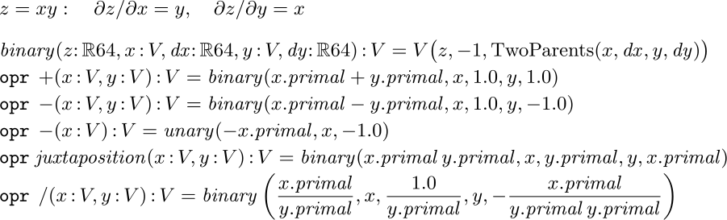

`opr +(x:V,y:V)` gives ordinary addition its differentiated meaning. `opr juxtaposition(x:V,y:V)` makes `x y` multiplication. Unary minus, division, square root, exponentiation, exponential, logarithm and ReLU complete the scalar vocabulary; mixed `RR64` overloads insert constant nodes. The multiplication figure shows the actual local partials passed to `binary`, so the concise notation does not conceal the chain rule.

To compute a gradient, `visit` marks each node once, visits its parents, then prepends it to a linked chain. This places every result before its parents in the reverse traversal. Seed the loss adjoint with 1; `push` adds each local derivative times the current adjoint into its parent. A parameter node also adds to the output array at its immutable parameter index. Finally `clear` resets the visited flags and adjoints for another sequential gradient call.

Shared subexpressions matter: two uses of the same node must both contribute, while its parents must be propagated only after those contributions accumulate. Traversal takes O(nodes + edges), rather than recursively propagating once per path. The retained scalar probe checks repeated gradients, a shared diamond with $2^{30}$ paths, and an 8,191-node tree. This implementation uses recursive traversal and a linked reverse chain, so the demonstrated interpreter runs use a 32 MB Java stack. It is educational machinery, not an industrial autodiff engine.

Graph construction allocates fresh nodes and immutable edges, without a shared allocation counter. Mutations of `seen` and `adjoint` occur during the sequential reverse phase. Concurrent `gradient` calls on overlapping graphs are unsupported; ordinary independent forward cells need not be serialized.

## 2. Store finite vectors without losing graph sharing

Mathematical notation treats $x_i$ as a selection, not a recomputation. Accordingly `Vec(n,f)` evaluates `f(i)` once per cell and stores the resulting scalar node; `Mat(m,n,f)` stores rows of these vectors. Python would use `[f(i) for i in range(n)]` and nested lists.

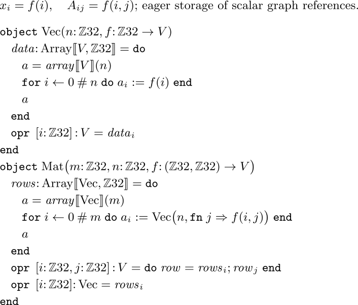

The enclosing operator `opr[i:ZZ32]` supplies subscripting. For a matrix, `opr[i,j]` first binds a row, then indexes it. That local binding is deliberate: this interpreter failed on a directly chained `rows[i][j]` expression. The dimensions are ordinary runtime fields; these types do not prove shape compatibility. The fixture supplies compatible shapes, and a general-purpose library would need shape checks or stronger dimension types.

Why define containers at all? The shipped `Vector` requires `T extends Number`, and this checkout's `Number` is a closed `comprises { RR64 }` hierarchy. A new graph scalar cannot simply join that hierarchy. These small containers are a user-level design choice around that library constraint, not evidence that Fortress has no vector abstraction. See [the library API](../../../Library/FortressLibrary.fsi), the `Number` and `Vector` declarations.

## 3. Teach summation to the scalar algebra

A matrix product needs $y_i=\sum_j A_{ij}x_j$. A loop can compute it, but a summation communicates the contraction directly. The scalar `+` overload is only half the construction: the big operator also needs a reduction identity and a way to join terms.

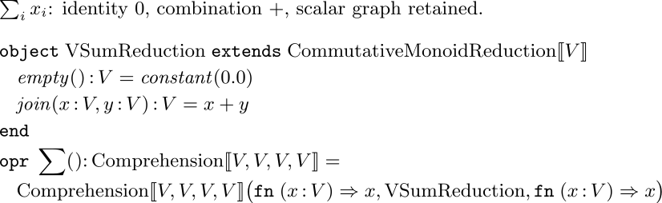

`VSumReduction` extends the library's `CommutativeMonoidReduction[V]`. Its empty sum is `constant(0.0)`; its join constructs a differentiated sum node. `Comprehension[V,V,V,V]` supplies identity mappings around that reduction. Defining zero-argument `opr SUM()` lets the generator expression `SUM[i <- 0#n] ...` use this algebra. The range `0#n` means the `n` indices starting at zero, so its last element is `n-1`.

There is an essential import detail:

```fortress
import FortressLibrary.{...} except { opr BIG + }
```

The standard big addition spelling collides with the local sum declaration unless excluded. The completed namespace probe demonstrates ordinary `SUM` after this exclusion; a failed initial overload attempt was not a language limit. We retain numeric maximum separately as `BIG MAXNUM`.

The [reduction API](../../../Library/FortressLibrary.fsi) supplies the inherited abstraction; our identity, join and comprehension instance supply the new behavior. Floating-point addition is not exactly associative. This uses the same mathematical reduction convention as numerical summation generally: reassociation may change rounding. We compare with tolerances and do not force a serial sum merely to reproduce Python's order. The [generator specification](../../../Specification/basic/expressions/generators.tex) requires assuming parallel iterations unless the generator is sequential.

## 4. Build linear algebra from the sum

Python's upstream linear layer is a nested comprehension: `[sum(wi*xi for wi,xi in zip(row,x)) for row in W]`. Fortress puts the row selection and reduction inside a matrix-vector juxtaposition overload. Dot product gets its own `DOT` operator.

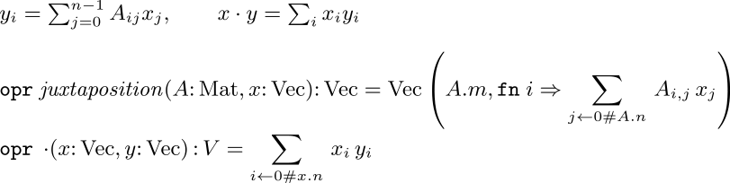

The resulting model can write `W x` and `x DOT x`; Fortify displays the latter with a central dot. We chose that dot over vector-vector juxtaposition because `x x` is visually ambiguous. Matrix-vector juxtaposition remains recognizable. This separation is a convention of this little algebra, rather than a new compiler feature. [Fortress's juxtaposition rules](../../../Specification/basic/operators/juxtameaning.tex) distinguish function application from operator application by the left operand.

Vector addition, division by a scalar, subtraction of a numeric shift, `exp` and `relu` are pointwise `Vec` constructors. For example, the complete vector division definition is `opr /(x:Vec,s:V):Vec = Vec(x.n,fn i => x[i]/s)`. These overloads account for the vector-level notation used below; a paper's short fraction is supported by actual cellwise computation.

## 5. Normalize scale, then turn scores into probabilities

RMS normalization divides by the root mean square with a small stabilizer. It has no learned gain or bias here, matching microGPT. Python computes `ms=sum(xi*xi for xi in x)/len(x)`, then `scale=(ms+1e-5)**-0.5`, then returns `[xi*scale for xi in x]`.

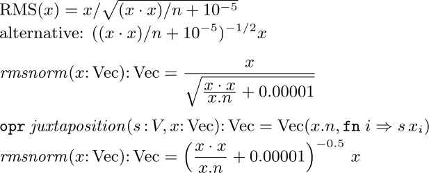

Both formulations in this figure were executed through the whole model and passed the same fixture, including gradients. The selected quotient places a radical under the vector, directly matching the target formula, and reuses vector division. The inverse-power alternative introduces scalar-vector multiplication and computes a scale first; that is closer to Python's operational form. Neither is mathematically superior. For teaching the formula, the quotient is the clearer local choice.

Tight division, written without spaces around `/`, is significant in Fortress's [precedence rules](../../../Specification/basic/operators/precedence.tex) and gives the actual stacked fraction here. Parentheses are part of the executable definition, not merely instructions to the renderer. An earlier wide figure clipped its Python caption; the final figures keep the formulas and source together and place Python in nearby prose.

Softmax transforms unrestricted scores into positive probabilities summing to one. Subtracting their maximum avoids unnecessarily large exponentials: adding or subtracting a common score does not change the distribution. Python computes `exps=[(v-max_val).exp() for v in logits]`, then `[e/sum(exps) for e in exps]`.

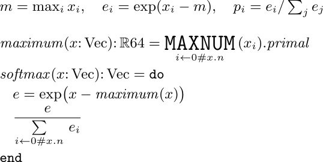

The maximum is taken on `primal` values, just as in the pinned Python. It is a detached numerical shift; shift invariance makes this valid for differentiating the resulting softmax. It is not a general derivative rule for maximum. Ordinary summation now survives visibly as a sigma. `MAXNUM` still renders as a word rather than the paper's `max`: this is a demonstrated library/rendering departure, and the figure leaves it visible.

## 6. Attention contracts over the past

For a head of width $d_h$, project the normalized current token to a query $q$. Keep one key and value row for each position seen so far. Then $Kq/\sqrt{d_h}$ measures the query's scaled similarity to each key. Softmax gives weights $a_t$ over those positions, and $o_j=\sum_t a_t W_{tj}$ mixes the corresponding value coordinates. The figure calls the value matrix `W` to avoid confusing it with scalar type `V`.

Python spells the two contractions as `sum(q[j]*K[t][j] for j in range(s))` and `sum(a[t]*W[t][j] for t in range(T))` inside outer comprehensions.

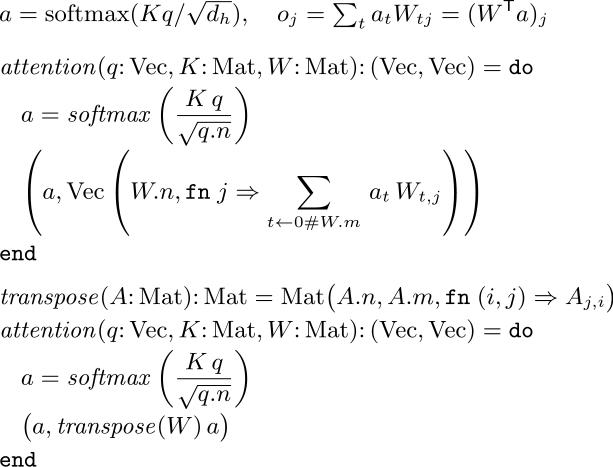

The chosen version exposes the time reduction explicitly. The alternative reuses matrix-vector multiplication as `transpose(W) a`, with a user-defined transpose constructor. This is a substantive alternate formulation and also passed the full numerical check. It allocates a transposed matrix of references; our straightforward implementation does not provide a lazy transpose view. Fortify renders the function name `transpose`, not a superscript T. The alternate is shorter at the call site, but the direct sum better shows which axis is contracted without adding another representation operation.

Causality comes from construction: at position `t`, the matrices contain only `t+1` cache rows. There is no future row to mask. Token positions run through `sequential(0#3)` because later positions read earlier cache entries. Heads can be formed independently, and each writes a distinct output and attention-weight slot. The output weights are returned alongside the values for inspection; only the values feed the next layer.

## 7. Assemble a transformer block and predict the next token

Each head gets a contiguous slice of the projected query, keys and values. Concatenate the head outputs, apply the output matrix, and add the incoming residual. A second pre-normalized branch applies an expanding matrix, ReLU, and a contracting matrix before another residual addition. The expansion factor is four.

Python uses explicit elementwise lists for residual addition and `x_attn.extend(head_out)` for concatenation. The selected Fortress definitions below make both residual equations visible, while concatenation remains explicit index arithmetic.

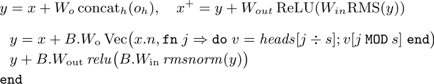

`heads[j DIV s]` chooses the head; `j MOD s` chooses its feature. This is less fluent than a paper's `concat`. It is a justified small-container implementation choice, not a claim that a concatenation operator is impossible. The local `v` binding also avoids chained subscripting in the interpreter.

Token and position embeddings are rows of learned matrices. Add them, normalize, apply the block, then project through the unembedding matrix to obtain vocabulary logits. Python starts with `x=[t+p for t,p in zip(tok_emb,pos_emb)]` and ends with `linear(x,lm_head)`.

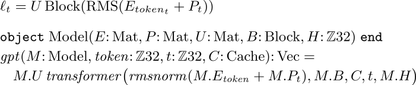

The first RMS normalization and the block's own pre-normalization are both retained. The residual branch means dropping the first is not generally equivalent. There is no positional rotation, dropout, bias, learned normalization gain, or final normalization added to this pinned microGPT architecture.

## 8. A scalar loss connects the whole graph

For input tokens `[2,0,1]`, the targets are `[0,1,2]`. At each position, negative log probability penalizes the model for assigning little mass to the actual next token. Mean cross-entropy is $L=-T^{-1}\sum_t\log p_t[y_t]$.

Python uses `losses.append(-probs[target_id].log())`, then `loss=sum(losses)/n` and `loss.backward()`.

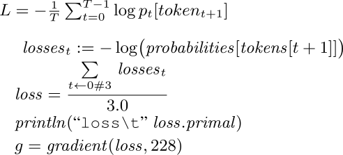

All three losses share parameter nodes through the model and share earlier cache graphs where attention uses them. `gradient(loss,228)` traverses the combined graph and returns every parameter derivative. Parameter identities are fixed by global row-major offsets when matrices are built, so forward evaluation order does not determine their identities.

## 9. Update parameters, then generate with a fresh cache

Adam keeps exponentially smoothed gradients $m$ and squared gradients $v$. Bias correction divides by $1-\beta^s$ at one-based step $s$. A linearly decaying learning rate controls the update; epsilon stabilizes the denominator.

Python updates `m[i]=beta1*m[i]+(1-beta1)*g`, similarly updates `v`, computes the two corrected moments, then subtracts `lr*m_hat/(sqrt(v_hat)+eps)` from the parameter.

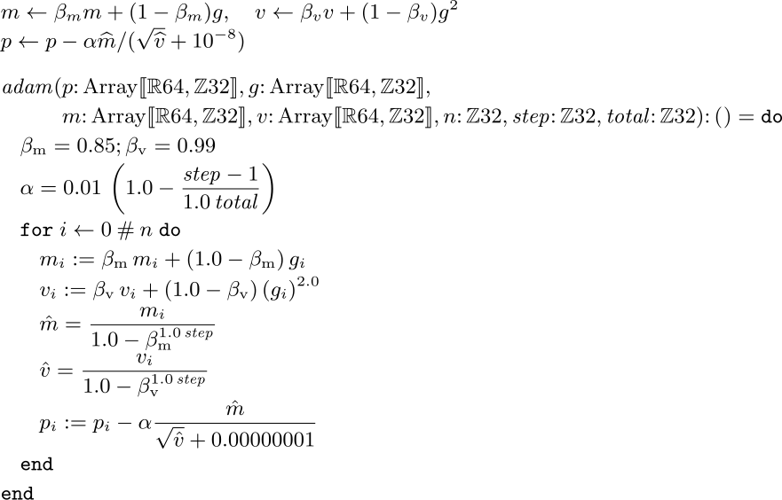

The Fortress routine takes one-based `step`; consequently `step-1` appears in learning-rate decay. The fixture performs `step=1,total=1`, starting both moment arrays at zero. At that step, the independently checked update simplifies to $p'=p-0.01g/(|g|+10^{-8})$. Later optimizer steps are implemented by the routine but are outside this fixture's demonstrated numerical coverage.

The parenthesized `(g[i])^2.0` in the figure is intentional. An unparenthesized indexed base failed in this interpreter even though the specification gives subscripting and superscripting left-associative precedence. Changing only the exponent did not repair it; grouping the indexed value did. The saved run logs preserve that integration failure.

Generation constructs a model from the updated parameters and uses a fresh cache. Begin with BOS token 2; predict, divide logits by temperature 0.5, sample, feed the selected token back, and stop on BOS or the context limit. Python uses `random.choices`; the check injects uniforms into the equivalent inverse-CDF operation.

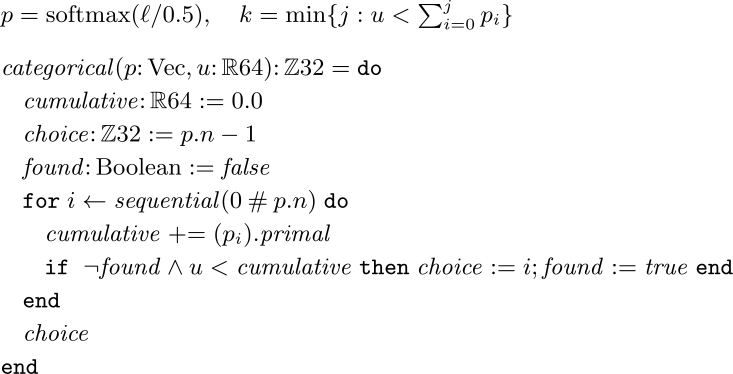

The strict inequality implements half-open CDF intervals. Uniforms `[0.1,0.5,0.9]` select `[0,1,2]`, including the terminating BOS. The fallback is the last category if roundoff leaves the accumulated total slightly below one. This function assumes a valid uniform in `[0,1)` and valid probabilities, as supplied by the fixture.

## 10. What has actually been established

The selected program's completed run took 4.438 seconds in the historical interpreter, including startup and TSV output. The alternative took 3.935 seconds. These single runs establish bounded feasibility, not a performance comparison. No long training was run.

| Quantity checked against Python | Coverage | Selected maximum absolute error |
|---|---:|---:|
| Initial parameters | 228 | 0 |
| Training logits | 9 | 5.56e-17 |
| Training probabilities | 9 | 0 |
| Attention weights | 12, both heads | 5.56e-17 |
| Mean loss | 1 | 0 |
| Gradients | 228 | 2.23e-16 |
| Updated parameters | 228 | 3.47e-16 |
| Generation logits and probabilities | 9 each | 5.56e-17 |
| Selected tokens and supplied uniforms | 3 each | 0 |

Loss is `1.147958783149666`. The strict converter rejects missing cells, duplicates, unknown records and non-finite values; it inserts only static metadata. Both full models pass the independent validator at absolute tolerance `1e-12` and relative tolerance `1e-10`. The Python gradients were separately checked by central differences for every parameter, with worst error `3.649e-10` at step `1e-6`. See [independent validation](../reference/INDEPENDENT_VALIDATION.md), [full actual values](actual.json), and [error summary](validation-summary.json).

This evidence is stronger than matching one scalar loss, but it is still one deliberately small configuration. It does not establish every shape, multi-block behavior, all floating-point extremes, higher derivatives, large-graph stack safety, concurrent backwards, or trained text quality.

The selected form is canonical **for this experiment**: ordinary sum, matrix-vector juxtaposition, explicit vector dot, RMS quotient and explicit attention contraction. Actual alternative execution and visual inspection support those local choices; this specimen does not establish a unique optimum for Fortress or ML languages generally.

## Reproduction and remaining departures

The [reproduction guide](REPRODUCE.md) gives the bounded commands and exact evidence locations. [Figure extraction](make_figures.py) takes literal source slices, writes formula-captioned `.tic` sheets and records source hashes; `experiment/render.py` runs Fortify, LaTeX and dvisvgm. PNGs were inspected beside their mathematical captions. The two comparison figures were inspected before selecting the final formulations, and a clipped RMS caption was split and rendered again.

The support is not free: the executable contains the scalar graph, reduction, eager containers, vector overloads, cache representation, parameter mapping, optimizer and sampler before the fixture driver. [The source inventory](SOURCE_INVENTORY.md) separates those from the short mathematical core and from test output. Rendering an entire transliteration alone would not have supplied the mathematical correspondences above.

| Remaining departure | Classification and evidence | Consequence |
|---|---|---|
| Closed shipped `Number`/`Vector` scalar constraint | Library design restriction, API declarations | Define user-level AD containers; no runtime changes |
| Local SUM collides with imported big addition | Namespace/import integration, successful excluded-import probe | Retain explicit import exclusion; ordinary sigma works |
| `MAXNUM` and `transpose` remain words | Observed library/rendering spelling | Figures show the actual mismatch; no claimed impossibility |
| Chained subscripting / indexed power fails | Interpreter gap relative to documented postfix precedence; saved failures | Bind intermediate row or parenthesize indexed base |
| Concatenation uses `DIV`/`MOD` and a constructor | Deliberate representation choice | More support visible than the paper's `concat` |
| Floating sum is not exactly associative | Numerical approximation in reduction abstraction | Permit parallel reassociation; compare with tolerances |
| Mutating reverse pass is sequential | Deliberate graph algorithm dependency | No concurrent gradients on shared nodes |

No compiler, interpreter or shipped library was modified to make these forms run. The open work for a revival is concrete: minimize and fix the subscripting regressions, consider AD-friendly generic numerical containers, and improve rendering conventions for the remaining named operations. The successful ordinary summation investigation should not be misreported as an unresolved language limit.
