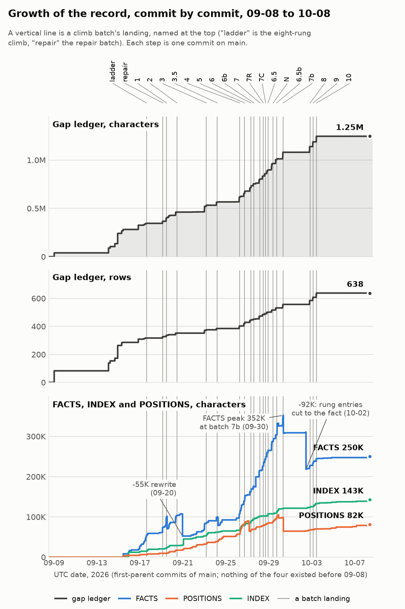

<!-- The Fortress revival from 2026-08-19 to 2026-10-08 told in plain words for the curator: the exploring era, the unsealed tree and the climb batches with their decisions and the checker's errors, how the record grew, the skills and process work since 10-04, what changed in Fortress for a programmer, whose Fortress the skill's language points describe, and six changes for that section of the skill; read-only, from the record. -->

# The revival so far, in plain words

Written 2026-10-08 for the curator. Dates are 2026, times UTC. Each part ends with its sources.

Words used throughout:

- **team**: Sun Labs designers of Fortress. Their last commit is `a874948ac` (2012-08-31).
- **walk**: Interpreter. It runs a program with no static types.
- **compiled path**: Path that compiles a program to JVM bytecode and runs it: `fortress compile`, then `fortress run`.
- **checker**: Static type checker. It runs on the compiled path only.
- **library**: Fortress code that every program loads. There were two. The interpreter's is **the one library**. The compiler's own smaller one is **the prelude**.
- **switch-over**: Point at which the compiled path moves onto the one library and the prelude is deleted. It comes when the checker accepts the one library.
- **gap ledger**: File with one numbered row for each known gap or defect.

## 1. The start and the exploring era (08-19 to 09-16)

**The 2012 tree builds and runs again.**

- 08-18 and 08-19: the tree built on JDK 8, and the team's tests ran: about 1.4K in `testFast`, 382 in `testSystem`.
- 08-19: the first toy programs ran under walk: a small demo, a Mandelbrot set ported from Swift and rewritten in plain Fortress style, and a ring of complex numbers.
- To 08-21: the build moved to current Java and Scala. These 21 commits change nothing a Fortress programmer sees. The suites ran in parallel, 13 minutes down to 7.5.

**The microGPT rounds (08-23 to 08-30).** microGPT is Karpathy's small GPT in Python. Each round wrote it in Fortress and ran it under walk. A golden check compared its numbers with the Python program's.

- Round 1 (08-23): a direct port. A training step took 10.9 s, against 22 ms in Python.
- 08-24 to 08-30: rewrites in plain Fortress style and in a paper's mathematical style, then a second iteration. The session began to use worker agents.

**Other assistants (09-07 to 09-11).** Astra, another company's coding assistant, wrote its own port outside this session, with no transcript. Later Astra and a second assistant, Sol, joined a discussion of notation.

**Blinded and informed runs (09-08 to 09-15).**

- The blinded run (09-08): a fresh session that could not read the earlier ports. It worked alone for 1.5 hours and wrote 15 gap rows.
- Run B (09-09) could read the earlier work: 25 gap rows. Run B2, the coordinating session's own attempt: 39 rows.
- Runs C to C4 (09-14) used a "flat" layout, after Hsu's data design for array languages. C4 merged C2 and C3: a 71-line model passing 40 of 40 checks.
- The APL side quest (to 09-15): APL notation turned into Fortress code by a grammar extension, then microGPT written in it. The curator closed the quest there.

**The ledger's first 309 rows.** Each run wrote a gap table. A merge worker re-ran every reproducer, numbered the rows and folded repeats: 83 rows on 09-08, 139 after Runs B and B2, 265 after the APL merge, rows 288 to 310 on 09-16. Row 148 is empty on purpose. `FACTS.md` (what is established) and `POSITIONS.md` (the curator's decisions) began on 09-15.

**The territory map (09-16).** Before any edit to the team's code, five surveys described the system: modules, what of the specification is built, tests, dormant code, and the designers' reasons. Two of its facts: the interpreter's tests and the compiler's tests share no program; `Specification-1.0-frozen/` is the team's draft of 2011-02-02, and `Specification/` is the text the revival revises.

**The sealed tree.** The tag `sealed-tree` (`75cca6683`, 09-16) is the last commit before the revival edited the team's code.

Sources: `explorations/process-records/01-microgpt-port.md` to `14-apl-rung-4b.md`; `explorations/microgpt-run-c-handover.md`; `explorations/microgpt-run-c-handover-history.md`; `explorations/coordinator/map/README.md`; `explorations/coordinator/process-engineering/gap-ledger-archaeology.md` section 1.1; `explorations/coordinator/process-engineering/fortress-changes-chronology.md` A0, A1, A10; `explorations/notation-collaboration/README.md`.

## 2. The unsealed tree and the batches (09-17 to 10-03)

**How a batch works.** A batch is one run of a workflow script.

- A **rung** is one piece of work, done by a worker in its own checkout of the tree.
- A **skeptic** checks each rung. If it refuses, a **judge** rules, a **repair** agent fixes, and a second skeptic checks.
- The **gather** folds each rung's notes into the record. A **merged-diff review** reads the combined change.
- The **gate** is the full check before landing: the build, both suites, 13 compiled `atomic` programs at four threads, the ladder (below), and the checker's error counts. To **land** is to commit to `main` and push.
- After each batch, one reviewer checks it against the decisions and the designers' intent.

**The first climbs (09-17 to 09-20).** The ladder is 410 of the team's test programs pushed through the compiled path. On the sealed tree 59 passed.

- The ladder climb (09-17): eight rungs added names to the prelude and compiled a top-level `var`. 81 passed. A review found one rung against the specification and one departing from it without a reason.
- The repair batch (09-18 to 09-19) fixed those two.
- Batches 1 and 2 (09-19, 09-20) added more prelude names: `RR64`'s functions, `Maybe`, `GCD`, shifts, integer conversions. 85 passed, and 85 still pass.

**Batches 3 to 10 (09-22 to 10-03).** From 09-21 every batch worked to make the checker accept the one library: 16 landings in 12 days. Names such as 3.5, 6b, 7R, N or 7b are batches split from or added to a plan. Batches 8 to 10 repaired checker defects and the library's one-off slips. The decisions below say which batch built each one.

**The main decisions, in plain words.**

- **The goal** (09-16). Finish what the designers intended, judged by the specification as revised. The measure is microGPT compiled and running fast. The tree was unsealed on 09-17.
- **Test first** (09-17). Every edit starts from a failing test that stays in the suite. Expected-failure tests (files named `XXX…`) grew from 56 to 229.
- **One library** (09-21). The interpreter's library becomes the only one. The prelude gets no new declaration and goes at the switch-over. The rungs that added prelude names stopped, and the checker's errors on the one library became the measure.
- **The flat number tower** (09-24). The checker keeps the team's rule that no type extends two instantiations of one generic trait. The one library's nested number types broke it, so they became siblings that convert by declared coercions, as in the prelude. Walk learned coercion in batch 4; the library was flattened in batch 6. The checker's errors fell from 125 to 62.
- **Sizes at run time** (09-24). A size parameter (`nat`) gets the run-time descriptor a type argument has. Since batch 5, a sized program compiles and runs.
- **Overflow** (09-26). Fixed-width overflow raises `IntegerOverflow` under walk too. Code meant to wrap uses the specification's operators ∔ ∸ ⨰. Batches 5 and 6b.
- **The plan** (09-26). Six phases: 1 and 2, decided work and the flattening; 3, the checker at zero errors; 4, the switch-over; 5, microGPT compiles; 6, microGPT fast. Phase 3 paused after batch 10; phases 4 to 6 have not started.
- **Ranges over `ZZ32` only**, because a JVM array index is a 32-bit integer. Batch 7R.
- **The inference rule.** When a generic call mixes number types, the type parameter takes the narrowest type all arguments convert into. A parameter nothing fixes takes its declared bound, never the empty type `Bottom`. Batches N, 8 and 9.
- **The overloading model.** Overloads may differ in static parameters. The return-type rule is checked for every instance. Walk chooses by declared types, not by order in the file. Batch 7b.
- **`fill` takes a value, `tabulate` a function.** Batch 7.
- **Arrays become unboxed `double[]`** (09-19). Decided, not built.
- **Each change to the specification** gets a note at the passage and an Appendix I entry with the original text and the reason.

**The checker's errors falling.** Two numbers measure the way to the switch-over.

- **The checker count**: the errors the checker reports on the one library. The checker stops early in each api file, so the count misses errors behind the stop. A gate stage from batch 3.
- **The distance to the switch-over**: every error over all the library's files, with no early stop. First measured before batch 7.
- Neither makes the gate red. A fix can raise both, when it lets the checker reach code it could not reach before.
- Count by batch, where it moved: 93 before 3; 103 after 3; 125 after 4 (a fixed crash showed 22 hidden errors); 62 after 6; 22 after 7; 10 after 7R; 75 after 7C (the checker now reads a clause it used to stop at); 59 after 7b; 56 after 8; 1 after 9 and 10. The last is a pair in `LexicographicReduction` (row 582), left by the curator's choice.
- Distance by batch, where it moved: 1.7K before 7; 940 after 7; 627 after 7R; 598 after 7b; 565 after 8; 340 after 9; 253 after 10.
- Of the 253: about 95 are arrays, waiting for the array design; 36 are ranges held for the curator; 30 are in bodies of self-typed traits and wait for a judgement.

**Where the tokens went.** "Written" means tokens processed fresh: cache writes and new input, the measure the curator uses.

- The 15 batches from the repair batch to 6.5b used 269 agents and wrote 146M tokens.
- Rung workers took about half; skeptics, judges, repairs and reviews about a third.
- 45% of all writes came after an agent waited five minutes or more. The prompt cache lives five minutes, so the agent wrote its whole context again.
- The largest batches: 7 (22M), N (18M), 6.5b (17M). After the post-mortem: 7b 7.3M, 8 and 9 14.6M together, 10 6.3M.

**Where the records went: the post-mortem of 09-29.**

- Batch 6.5b changed about 280 lines of Fortress code, 90 of specification and 710 of tests. Beside them it committed 866 record files, 46K lines, most of them scratch.
- Nobody had asked the curator whether scratch goes to `main`. It came from six small steps. On 09-19 he asked whether logs were needed. Gate logs stayed out, but rung outputs were then named `.txt`, so `.gitignore` missed them, and he was not told.
- Two cleanings removed 4.4K files (11.7 MB) on 09-29 and 9.9K files (173 MB) on 09-30.
- The new practice: commit only what `main` is to hold; commit the test alone and see it fail first; build or run nothing twice. Batch 7b committed 20 record files.

Sources: `explorations/microgpt-run-c-handover.md` and `explorations/microgpt-run-c-handover-history.md` (the landing paragraphs); `explorations/coordinator/PLAN.md` ("The phases"); `explorations/coordinator/POSITIONS.md`; `explorations/coordinator/postmortem-2026-09-29/README.md` and `characterization.md`; `explorations/reviews/batch-6.5-review.md` to `batch-10-review.md` (first sections); `explorations/compile-ladder/CLIMB.md`; `explorations/coordinator/process-engineering/README.md`.

## 3. How the record grew

The chart has three panels on one time axis. A vertical line marks each batch's landing. Top: the ledger's characters. Middle: its rows. Bottom: FACTS, POSITIONS and INDEX (INDEX has one line for each note under `explorations/`).

- The ledger reached `main` on 09-09 with 83 rows. It reached 638 rows and 1.25M characters at batch 10 (10-03), and has not changed since.
- The exploring era wrote 309 rows, 0.8K characters each on average. Today they hold 0.31M characters.
- The batches wrote 329 rows. At entry they were two to three times as long: 2.6K on average in the first batches, 1.4K in batches 8 to 10. Later edits made them 40% to 55% longer. Today they hold 0.88M characters.
- So most of the ledger's text came from the batches, not from the exploring era.
- Rows almost never shrink: after entry they gained 308K characters and lost 0.8K.
- From 09-17 to batch 10, batch runs took 35% of the clock. They brought 88% of the ledger's new characters and 92% of its new rows.
- FACTS peaked at 352K at batch 7b (09-30). On 10-02 it lost 92K in one commit, when the rung entries were cut to the fact. It is 250K now.
- POSITIONS peaked at 105K (09-29) and is 82K now. INDEX has only grown, to 143K.

Sources: `explorations/coordinator/process-engineering/record-growth/README.md`, `per-batch.csv`, `landings.csv`; `explorations/coordinator/process-engineering/gap-ledger-archaeology.md` sections 1.1 and 2.4.

## 4. Since 10-04: the skills and the process

**The process-engineering study** (opened 10-03) asks whether the weekly token pool is spent well.

- Sharing one build between checkouts had been called impossible for two weeks. Given the goal, fresh agents found the way in about 15 minutes. The waste was 245 of 425 builds, about 7.3 agent-hours.
- One probe wrote 7.0M tokens against an estimate of 0.5M. Now the coordinator watches a long run against its estimate.
- Six designs for running batch 10 were priced: four at 4.5M to 7.5M, two with no cost limit at about 31M and 37M. Whether to design a workflow for each batch waits on the curator.
- Next: redesign the round after a skeptic refuses.

**The `fortress-repo` skill**: the instructions every agent loads to work here.

- 10-04: three project skills written from the record and reviewed.
- 10-05: a reader given only the skill found about 30 passages a new reader could not act on.
- 10-05 and 10-06: the curator reviewed it, about 35 comments, grouped as eight lenses. A writer applied them, and every file got shorter.
- 10-07: the skill gained two modes of work, building and exploring.
- 10-08: a fresh session answered a quiz on Fortress from pre-training alone; an audit graded 56 claims correct, 7 wrong, 3 outdated. The section "Fortress as a language" came from it.

**The context study** (10-08): what batch 10's four rung workers read before their first fix.

- Of what they read: the briefing 25%; code, library, specification and tests 48%; their own searches of the record 4%.
- Relearning what the record held was common but small: about 1% of what they read.
- A "librarian" pass after each batch would cost 0.7M to 0.9M tokens. It pays if it turns the causes of refusals into skill rules.

**The ledger.**

- An archaeology (10-08) proposed a form. The curator decided: one status word of seven, a class with its area, at most 1.2K characters a row, topic sections with every number kept, the old text in a history file, one tool, `ledger.py`, to write it.
- The ledger check (10-08) compared about 490 rows with the batch records and found three mismatches.
- The ledger rewrite is running now: one agent groups the rows by topic and spots duplicates, a rewriter takes each group, a merge agent writes the ledger. Estimate: 2.5M tokens, 3.5 hours.

**The climb** has been paused since 10-03. Batch 11 is not drafted.

Sources: `explorations/coordinator/process-engineering/README.md`, `context-study.md`, `ledger-check.md`, `gap-ledger-archaeology.md`; `explorations/coordinator/INDEX.md` (last 15 lines); `explorations/coordinator/POSITIONS.md` (the ledger's form, the skills); `explorations/coordinator/postmortem-2026-09-19/held-list.md` (the boot note).

## 5. What the revival changed in Fortress itself

Changes a programmer writing Fortress would notice, by area.

**Numbers**

- The number types are siblings under `Number`, not a tower, as the team's compiler library already had them. A wider type converts from a narrower one by a declared `coerce`.
- Fixed-width overflow raises `IntegerOverflow` under walk, as on the compiled path. To wrap on purpose, write ∔, ∸ or ⨰.
- `SUM` and `PROD` are generic. A clause form whose element type nothing fixes must name it: `SUM[\ZZ32\][j <- 0#i] f(j)`.
- `QQ` is exact. A negative shift count shifts the other way. `GCD` and `LCM` are never negative. `narrow` keeps the low 32 bits. `round` sends an exact half to the even integer.
- The library's numeral type is `IntLiteral`, a sibling every number type converts from. Walk's numerals are unchanged for now.

**Ranges.** Ranges are over `ZZ32` only. A range over `ZZ64`, `NN32`, `NN64` or `ZZ` stops when built.

**Arrays and the rest of the library**

- `fill` takes a value; `tabulate` takes a function.
- `String`'s juxtaposition is three top-level operators.
- Array storage is still boxed.

**Walk**

- Walk converts by coercion at calls, bindings and assignments, picking the coercion from the run-time value.
- Walk infers type arguments through coercions. A type parameter nothing fixes takes its bound.
- Walk chooses between a generic and a plain declaration by declared types, not by order in the file.
- At load, walk refuses some programs it used to run: an object extending two closed traits without being listed, and two functional methods with no declaration on their meet.

**The checker**

- It checks `nat` and `int` size parameters, and infers static arguments through coercions.
- Overloads may differ in static parameters. The return-type rule is checked for every instance.
- It judges two functional methods for each type that provides both.

**The code generator and the run time**

- A top-level `var` compiles, and `atomic` covers it.
- A numeral of exactly 32 or 64 bits keeps its value.
- A sized program compiles, loads and runs. Generic code dispatches correctly on four threads.
- An object with no `asString` prints its type name.

**The specification.** Appendix I has 37 entries, each with the original text and the reason.

**Size of the internal changes**

- 122 commits touched the code, library or specification: 28 before the tag, 21 of them toolchain; 94 after it.
- Lines added: walk 2.8K, checker 1.2K, code generator and run time 1.0K, specification 4.7K, tests 12K. The library gained 3.0K lines and lost 2.1K.
- The grammar is unchanged. 43 of the team's test and demo files changed. The suites grew from about 1.4K and 382 tests to 1.8K and 516.

Sources: `explorations/coordinator/process-engineering/fortress-changes-chronology.md` part A.

## 6. The team's Fortress or ours

The skill has a section "Fortress as a language". It has eleven points. Each point corrects a belief that an agent may bring from its training. This part says, for each point, whether it describes the language that the team left or a change that we made.

### The eleven points

These are the bullets of the section "Fortress as a language" in the `fortress-repo` skill's `SKILL.md`, numbered in their order there:

1. Only the compiled path checks types.
2. A call chooses among overloaded declarations by the run-time types of all its arguments.
3. Functional methods: a method with `self` among its parameters is called as `f(x)`.
4. Traits and objects, no classes.
5. Static parameters, written `[\T\]`.
6. Numbers are side by side, not a tower.
7. Evaluation is parallel by default.
8. Loops and reductions are library code.
9. Juxtaposition is an operator, and spaces count.
10. Declarations: `x = e`, `var x: T = e`, `x := e`.
11. What the specification describes and nobody built.

### The team left three sources that disagree

The team did not leave one consistent language. It left three sources:

- the specification, the text that says what Fortress is;
- the interpreter (walk) and its library;
- the compiler and its own, smaller library.

These sources disagree in places. Where they disagree, we chose one side. Usually we chose the side that works with the type checker.

### Example: the number types

- The team's interpreter library put the number types in a tower. A narrower type was a kind of the wider type: `ZZ32` was a kind of `ZZ64`, and `ZZ64` was a kind of `ZZ`.
- The team's compiler library put the number types side by side, by 2009. No number type is a kind of another. A wider type converts a narrower value when a call needs it.
- In 2010 the team added a rule to the type checker: a type may not be two versions of one generic trait. In the tower, `ZZ32` is both an `AdditiveGroup` of `ZZ32` and an `AdditiveGroup` of `ZZ64`. The rule refuses this. The side-by-side types obey the rule.
- On 09-24 we put the interpreter's library side by side too, so that the checker accepts it.

So a model that remembers the tower remembers the team's interpreter library correctly. What it does not know is that the team's compiler had already left the tower.

### Points that are the team's

These points describe the team's language with no change:

- Point 3: functional methods.
- Point 9: juxtaposition and spaces.
- Point 10: declarations.
- Point 11: what the specification describes that the team never built.

These points are the team's, with a small change of ours:

- Point 1: only the compiled path checks types. The team's tool turns the checker on for `compile` and off for walk. We did not change this. Walk now checks some things when it loads a program, but these are not static types.
- Point 7: evaluation is parallel by default. Our change: the test suites run on one thread. We set this in the build file.
- Point 8: loops and reductions are library code. In Fortress, a `for` loop, a comprehension and `SUM` are not built into the language. The compiler turns each one into calls to library objects: a generator, which produces the values, and a reduction, which combines them. This is the team's design. Our change: `SUM` and `PROD` are now one generic declaration each, so when nothing in a clause fixes the element type, the program must write it: `SUM[\ZZ32\][j <- 0#n] f(j)`.

### Points that mix the team's language and our changes

- **Point 2, choosing among overloaded declarations.**
  - The team's: the checker's three rules, and walk's check when it loads a program.
  - Ours: declarations of one name may differ in their type parameters. The checker tests the return-type rule for every instance. Walk checks more when it loads a program.
- **Point 4, traits.**
  - The team's: traits, objects, `excludes` and `comprises`. Also the rule that a type may not be two versions of one generic trait. The rule is in the team's papers and checker, but not in the 2011 specification.
  - Ours: we read a `comprises` clause as "every value of the trait is a value of a listed type". This follows the team's later Types chapter of 2012.
- **Point 5, static parameters.**
  - The team's: the kinds of static parameter, and generics that keep their type arguments when the program runs.
  - Ours: a type parameter with no written bound has the bound `Any`. The 2011 specification says `Object`. A type parameter that nothing in a call fixes takes its bound. Sizes work on the compiled path.
- **Point 6, numbers.**
  - The team's: the side-by-side number types of the compiler's library, and the algebra traits such as `AdditiveGroup`.
  - Ours: the interpreter's library has the same side-by-side types now. Walk converts between number types. Walk raises `IntegerOverflow` when a fixed-width result does not fit.
  - The team's walk had no conversion between number types, and it wrapped a result that did not fit.

### Where the quiz was right about the team

A fresh model answered a quiz on Fortress from its training alone. The audit marked some answers as wrong. Some of these answers are right about the team's Fortress:

- The tower of number types: right for the team's interpreter library.
- Arithmetic that wraps: right for the team's walk. The team's specification and compiler raised an error.
- No conversion in walk: right for the team's walk.

Other answers marked wrong come from the team's own specification. The specification describes more than the team built:

- `Monoid[\T, ⊕\]` with laws: a chapter of the specification. The library has it only in a comment.
- `fortress run Foo.fss`: the specification's overview says this. The team's tool runs a program under walk with `fortress Foo.fss`.
- Complex numbers: named in the specification, in no library.
- Tests that state their expected output: the team's compiler tests do this. Its interpreter tests do not.

Two answers are wrong for both the team and us: integer types that wrap by themselves (the specification wraps only with its special operators), and an `Any` type that does not hold tuples.

Sources: `explorations/coordinator/process-engineering/fortress-changes-chronology.md` part B; `.claude/skills/fortress-repo/SKILL.md` ("Fortress as a language"); `explorations/reviews/fortress-pretraining-quiz.md`; `explorations/reviews/skills-distillation-audit.md` section B.

## 7. What this means for the skill

Six changes to the section "Fortress as a language", so that an agent knows which behaviour is the team's and which the revival chose. The skill is not edited here.

1. Point 6: say that the team's interpreter library had a tower of number types, and that the team's compiler library had them side by side, which the checker's rule against two versions of one generic trait needs; that we put the interpreter's library side by side to match; and that walk's conversions and walk's `IntegerOverflow` are ours (the team's walk had no conversion and wrapped).
2. Point 5: mark the implicit bound `Any` and the bound for an unfixed parameter as revival decisions, since the 2011 draft says `Object`; say that sizes run on the compiled path since the revival.
3. Point 4: say that the rule against two instantiations is the team's (papers and checker) but missing from the 2011 draft, and that "every value has a listed type" is the revival's reading of `comprises`.
4. Point 2: say that the revival dropped the rule that overloads may not differ in static parameters, checks the return-type rule for every instance and widened walk's load check.
5. Points 7 and 8: say that the one-thread suites are the revival's build setting, and that ranges over `ZZ32` only and the written static argument of a `SUM` clause are revival changes.
6. A new point: the specification promises more than the team built; `Monoid[\T, ⊕\]` with laws, complex numbers and `fortress run Foo.fss` are the draft's text, not the tree.

Evidence, change by change:

1. `a874948ac:Library/FortressLibrary.fsi:335,370,406`; `a874948ac:ProjectFortress/src/com/sun/fortress/interpreter/glue/prim/Int.java:100-102`; `a874948ac:.../interpreter/evaluator/values/OverloadedFunction.java:792`; commits `d846e3644`, `917bb7b32`, `b628871a2`.
2. `Specification-1.0-frozen/basic/trait-parameters.tex:50`; commits `576b4c287`, `f3032eed8`, `669b77d03`, `3f297441c`, `e893a3e00`.
3. `a874948ac:Papers/Types/examples.tick:5,54`; `a874948ac:.../scala_src/types/TypeAnalyzer.scala:443-457`; commits `3924e7ec3`, `d8e0cd28e`.
4. `Specification-1.0-frozen/basic/overloading.tex:102-106`; commits `e2f1aa7e8`, `70d5486f9`, `7ed2a8387`, `833420ce4`.
5. `a874948ac:.../runtimeSystem/FortressExecutable.java:37-39`; commits `a0fcf0a96`, `3be1fecd7`, `d846e3644`.
6. `Specification-1.0-frozen/advanced-lib/algebraic-constraints.tex:1340`; `a874948ac:Library/FortressLibrary.fss:2823`; `Specification-1.0-frozen/preliminaries/overview.tex:62,83`; `a874948ac:ProjectFortress/src/com/sun/fortress/Shell.java:149,195,198`.

Sources: `explorations/coordinator/process-engineering/fortress-changes-chronology.md` sections B1, B2 and B4.
