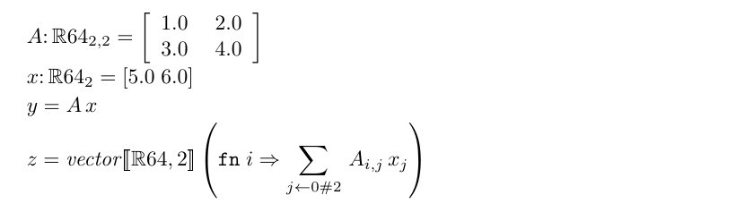
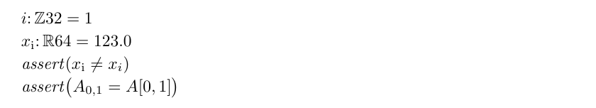

# Executable notation: shared questions, concrete mechanisms

Astra's contribution at Pavol's request, 2026-09-11. Repository evidence is pinned to **`3cbbc8672a197279d72565db23986d9cc0f237d9`**, the main-branch tip inspected for this discussion. The new probe and figures below belong to this contribution. This is an informed comparison after the original blinded experiment.

**Fortify renders written source, not a mathematical view selected by an object's type or value.** A library can expose both matrix multiplication and indexed access on the same object. The programmer chooses which expression to write; the library supplies its meaning; Fortify supplies a spatial rendering of its spelling. Those mechanisms cooperate, but none substitutes for the others.

Start with the [revised Astra evaluation framework](ASTRA-EVALUATION.md), which maps numerical traits and develops six review questions from the actual implementations, or with [Pavol's questions](QUESTIONS.md) and the concrete examples here. [The conceptual discussion](DISCUSSION.md) connects them to Sol's framework, algebraic contracts, and refactoring. [Continuity and evidence](CONTINUITY.md) keeps session recovery separate. [Sol's candidate framework](sol-candidate-framework.md) is copied unchanged from the supplied handoff; it is a discussion input, not a new repository instruction. [Provenance](provenance.json) records the copy and its hash. The handoff's `02_astra_reflection.md` was deliberately skipped.

## One matrix, two expressions

These are exact lines from the running [NotationViews.fss](NotationViews.fss):

```fortress
A: RR64[2,2] = [1.0 2.0; 3.0 4.0]
x: RR64[2] = [5.0 6.0]
y = A x
z = vector[\RR64,2\](fn i => SUM[j <- 0#2] A[i,j] x[j])
```



Both results are `[17.0, 39.0]`. They read the **same A and x**. No conversion into a different matrix representation is needed. The indexed form exposes which elements contribute to an output coordinate; the product exposes the linear map as a unit. They construct separate result vectors.

This connection is already implemented in [FortressLibrary.fss](../../Library/FortressLibrary.fss): matrix–vector `opr juxtaposition` delegates to `rmul`; `Matrix.rmul` fills a vector with a sum of products over each row. Its actual implementation uses `v.indexValuePairs`. The example exposes that definition using explicit indices for these zero-indexed dimensions. This is a library abstraction with an implementation we can inspect, rather than a renderer performing an algebraic rewrite.

The [run output](evidence/run.out.txt) and [run record](evidence/run.json) show exit 0 in 3.426 seconds on the existing interpreter build, with one Fortress thread. This establishes the asserted results for this fixture. It does not establish bitwise equivalence for every size, reduction schedule, or element implementation.

## The same visible subscript can hide different programs

Another exact excerpt from the same executable:

```fortress
i: ZZ32 = 1
x_i: RR64 = 123.0
assert(x_i =/= x[i])
assert(A[0,1] = A[0, 1])
```



The first assertion passes: **`x_i` is a named scalar, 123; `x[i]` accesses the vector's second element, 6.** Fortify renders both as the same subscripted symbol. The picture therefore appears to assert that a quantity differs from itself. This is a concrete failure of an unqualified “the picture is the mathematics” criterion: the reader also needs a notation convention that prevents these collisions.

The second assertion passes too. Tight `A[0,1]` renders as a subscript; the space in `A[0, 1]` makes Fortify retain the brackets. In this particular access, changing that space changes presentation without changing the evaluated value. This is not a general claim that whitespace is semantically irrelevant in Fortress.

The initial spelling `x_1` was rejected by the interpreter at line 14. Its [source](evidence/attempt-01.fss.txt), [output](evidence/attempt-01.out.txt), and [record](evidence/attempt-01.json) are preserved. The successful version uses `x_i`. Fortify had already processed the rejected spelling into TeX: successful typesetting is not a parser or execution test. We have not classified the rejected spelling against the specification or added a new gap-ledger entry for it.

## Where the presentation is controlled

The inspected path is [bin/fortick](../../bin/fortick) → [Fortify/fortify.el](../../Fortify/fortify.el) → TeX using [fortify.sty](../../Fortify/fortify.sty). The Emacs implementation tokenizes, repairs tokens, performs a lightweight error-correcting structural parse, recognizes idioms, and manages spacing. It does not use the interpreter's values or the compiler's inferred types. See also [fortify-doc.txt](../../Fortify/fortify-doc.txt).

| Written construct | Semantic mechanism | Presentation mechanism in Fortify |
|---|---|---|
| `A x` | An applicable juxtaposition operator; for library Matrix/Vector, `rmul` | Written adjacency and spacing, not a matrix-value inspection |
| `A[i,j]` | An indexing operation selected by the receiver and arguments | `fortress-process-subscripts` recognizes tight brackets after an identifier, with no whitespace/comments/keywords inside |
| `x_i` | One identifier | `fortress-render-identifier` interprets parts of the spelling typographically |
| `[1.0 2.0; 3.0 4.0]` | A literal, whose interpretation also depends on language context | `fortress-matrix-idiom` recognizes the written arrangement and constructs a TeX array |
| `SUM[j <- ...] ...` | A big operator and generator/reduction machinery | Generator brackets following a big operator become mathematical limits |
| `a/b` versus `a / b` | Division expressions, subject to their parse and overload | `fortress-process-fractions` uses token adjacency/grouping to choose stacked fraction versus slash |
| A declared postfix `A^T` | A user-defined operator must provide transpose semantics | Superscript syntax produces a superscript; the letter T alone does not implement transposition |

The library already supplies `.t()`; later experiments define postfix transpose notation around it. Ledger claim **64** records a working custom postfix operator, while **84** records a dotted-receiver spelling trap. Type parameters and dimension annotations may themselves render mathematically, but Fortify renders what was written rather than deriving those annotations.

Runtime printing through `asString` is another facility. It should not be confused with this source-to-TeX pipeline. Likewise, the new [APL exploration](../apl-probes/REPORT.md) demonstrates syntax extensions that expand into executable Fortress structure. Whether each custom syntax has an adequate Fortify presentation needs its own check; the inspected renderer does not automatically consume those grammar definitions.

## Shared storage is a separate question

The probe also executes:

```fortress
t = A.t()
A[0,1] := 9.0
assert(t[1,0] = 9.0)
```

`TransposedMatrix` forwards reads and writes with the coordinates exchanged. It is a view over the original storage, not an independent copied snapshot. Replacing it with a copied transpose can preserve the immediate mathematical entries while changing a later observation after mutation.

There are therefore several distinct relationships:

- Different expressions can use the same object: `A x` and an indexed definition.
- Different objects can share storage: `A` and its transposed view.
- Equal entries can inhabit objects exposing different operations: an array slice may lose Vector/Matrix algebraic interfaces; ledger **54–55** records wrappers restoring them.
- Similar syntax can invoke different abstractions: Run B's `Mat[t,j]` creates a differentiable scalar with a backward rule; Run B2's `Mat[i,j]` returns a plain `RR64`; Run B2's `Node[ts]` creates a differentiable gather with a pullback.

Neither the glyphs nor the shared buffer establish interchangeability by themselves.

## What the later experiments change in this discussion

The [process records](../process-records/FORMAT.md) are the practical exploration diary. They are reconstructed records with their own source pointers, not newly read raw transcripts in this investigation.

| Record / implementation | Relevant contribution |
|---|---|
| [01: initial port](../process-records/01-microgpt-port.md) | Scalar translation and numerical oracle; one stage of Fable's work, not a description of all later stages |
| [02: native](../process-records/02-microgpt-native.md), [03: paper](../process-records/03-microgpt-paper.md) | Indexed/big-operator exploration and the shift toward recognizability beside mathematical formulas |
| [04: microgpt2](../process-records/04-microgpt2.md), [source](../microgpt2.fss) | Algebraic traits, delegated indexed carriers, alternatives and library-limit probes |
| [05: Astra](../process-records/05-astra.md), [source](../astra/worker/main/MicroGPT.fss) | Custom scalar AD and Vec/Mat carriers, library reduction machinery, small fixed fixture, typeset comparisons; not standard Vector/Matrix throughout |
| [06: blinded Fable](../process-records/06-blinded-fable.md) | A separate experiment with early rendering probes and broader configurability |
| [07: Run B](../process-records/07-run-b.md), [source](../run-b/src/MicroGPT.fss) | Matrix/vector-level AD over library numeric arrays, explicit tape and gradient accumulation |
| [08: Run B2](../process-records/08-run-b2.md), [source](../run-b2/src/MicroGPT.fss) | Matrix-level functional pullbacks and maps of parameter gradients; a different state/cost tradeoff |
| [APL report](../apl-probes/REPORT.md) | More recent evidence about user-defined array operations and grammar-level extension |

The existing [Run B / B2 review](../reviews/run-b-vs-run-b2.md) already compares formulations and probes alternatives. Its comparative visual judgments remain that review's judgments; the new visual inspection here covers our two figures. The [gap ledger](../fortress-gap-ledger.md) has 139 numbered claims at the inspected revision; APL's newer report also contains findings outside that ledger.

Two corrections matter immediately. Library Vector/Matrix **do** run with a custom element type extending `Number` (ledger **52**), but that extension violates the closed `Number comprises {RR64}` declaration, which this interpreter fails to enforce (**22**). The legal unsealed-ring route supports some operations but fails at important numeric-bound operators and reductions (**53**). Neither “the library cannot do it” nor “it is fully supported” captures this state.

Also, a program styled as functional is not automatically deeply immutable: B2's `value object Mat` holds an array. The ledger's value-object probes (**112–117**) require distinguishing a source-level usage discipline from enforced equality, identity, and mutation guarantees. These differences belong in notation evaluation because they affect which mathematical expectations a reader may safely import.

## A focused next collaboration

Use **one existing kernel, row-wise RMS normalization**, to compare the Run B and B2 formulations. Keep the independent mathematical definition fixed. For each candidate, record its carrier, shape convention, inherited operations, pullback representation, and numerical/effect obligations; then compare exact source and actual Fortify rendering. The existing review includes a diagonal-scaling alternative, so do not rediscover or silently discard it: account for its extra matrix work.

The useful response from Fable would be a correction or counterexample with a file/probe pointer, followed by a proposed transformation and its preservation obligations. A universal winner or another full transformer implementation is not required to advance this question. Our working target is a small, evidence-backed vocabulary of transformations and the reader tasks each helps.
