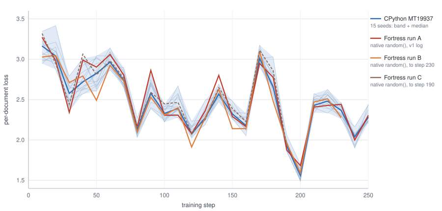

# Native PRNGs, head to head: Fortress `random()` vs CPython's Mersenne Twister

*Produced by a delegated worker session during the microgpt-native
exploration (design journal: `explorations/microgpt-native.md`). microgpt
nano config, 2026-08-24, JDK 25, CPython 3.11.15, `FORTRESS_THREADS=1`.
The re-assembled Python program and the raw run logs lived only in the
producing session's scratchpad (the blog code's license is unstated); the
chart is committed alongside as `explorations/prng-chart.svg` and its
numbers are reproduced in the tables below.*

Pavol's question: the v1 golden check deliberately removed the PRNG by filling
weights from a deterministic formula. **What happens when each side uses its own
native generator?** Answer up front: nothing visible. The two implementations
land in the same training regime, and the Fortress trajectory sits statistically
dead-centre in the CPython cross-seed band. The PRNG choice does *not* matter
here — but the *seeding* does, and that is where the interesting finding is.

---

## 1. What Fortress's `random()` actually is

**The call chain, end to end:**

| layer | location | what it is |
|---|---|---|
| Fortress source | `Library/FortressLibrary.fss:4123` | `random(a:Number):RR64 = builtinPrimitive("com.sun.fortress.interpreter.glue.prim.Float$Random")` |
| declared type | `Library/FortressLibrary.fsi:2398` | `random(a:Number):RR64` |
| interpreter glue | `ProjectFortress/src/com/sun/fortress/interpreter/glue/prim/Float.java:418-422` | `public static final class Random extends Util.R2R { protected double f(double scale) { return scale * Math.random(); } }` |
| marshalling | `ProjectFortress/src/com/sun/fortress/interpreter/glue/prim/Util.java:162-168` | `R2R` — one `RR64` in, one `RR64` out, via `FFloat.make` |

So `random(1.0)` is exactly `java.lang.Math.random()`. There is a 32-bit twin at
`ProjectFortress/src/com/sun/fortress/interpreter/glue/prim/RR32.java:366-370`
(`(float)(scale * Math.random())`), and `randomZZ32` is derived arithmetically
(`FortressLibrary.fss:4124`: `narrow |\random(x)/|`).

**The generator.** `Math.random()` is a single process-wide, lazily created
`java.util.Random` — a 48-bit linear congruential generator
(`seed' = (seed·0x5DEECE66D + 0xB) mod 2^48`), whose `nextDouble()` builds a
53-bit double from two successive draws. Period 2⁴⁸. The instance is constructed
with the no-arg `Random()` constructor, i.e. seeded from
`seedUniquifier() ^ System.nanoTime()`.

**Can it be seeded from Fortress source?** **No.** The glue exposes only the
scale argument; nothing in `Library/` reaches the underlying `Random` object,
and there is no `setSeed`-style primitive anywhere in
`ProjectFortress/src/com/sun/fortress/interpreter/glue/`. `FortressRandom`
(`.../interpreter/evaluator/transactions/util/FortressRandom.java:23`) is a
separate seedable subclass, but it is used only by the STM contention manager
(`.../transactions/manager/BackoffManager.java:34`) and is not reachable from
Fortress code.

**Are runs reproducible across JVM invocations?** **No** — time-seeded. Two
consecutive JVM starts (cheap check, `scratchpad/MathRandomProbe.java`):

```
JVM 1: 0.6305090758249051  0.5047746309308488  0.5951365660683143
JVM 2: 0.022100146173256174 0.21414333713709954 0.6234986287122418
```

The same shows at program level: the two fresh `microgpt.fss` runs below print
different step-10 losses (3.0275 vs 3.3184) from identical source. Every
`fortress explorations/microgpt.fss` is a new experiment.

**Bonus finding — the premise in `microgpt-port.md` is wrong.** The port doc says
"Python's Mersenne Twister is not ours". It is: **`Library/Random.fss` ships a
full MT19937 written in Fortress**, seedable and reproducible:

- `Library/Random.fss:263-320` — `MersenneTwister[\N, nat wordsize, nat degree\]`,
  the real twist + tempering loop;
- `Library/Random.fss:322-348` — `MersenneTwisterInit`, the reference
  `init_genrand` LCG (multiplier `1812433253`);
- `Library/Random.fss:354-363` — `mersenneTwister(seed:Vector[\ZZ64,624\])` /
  `mersenneTwister(seed:ZZ64)` / `mersenneTwister()`, with the reference MT19937
  constants (`0x9908B0DF`, m=397, r=31, tempering 11/7/15/18, masks
  `0x9D2C5680`/`0xEFC60000`);
- `Library/Random.fss:369` — `UniformDistribution` (no Gaussian: Box–Muller
  would still be ours to write);
- `Library/Random.fss:191-199` — `SystemRandomGen`, the only place the library
  touches the native `random(1.0)`, and only to *seed* the good generators.

It is exercised by `ProjectFortress/tests/RandomTest.fss:92-99`, which asserts
that two identically seeded generators produce identical streams — a test that
is in the currently green suite. So a seeded, bit-reproducible microgpt is
available today by importing `Random` and replacing `random(1.0)`; and because
`mersenneTwister(seed:ZZ64)` uses the reference `init_genrand`, matching
CPython's *stream* would only require porting CPython's `init_by_array` seeding
(~10 lines) — CPython's `random.seed(int)` uses `init_by_array`, not
`init_genrand`.

Caveat if that is ever attempted: `gaussMat` fills via
`array[\V\](n).fill(...)` (`explorations/microgpt.fss:184`), and `fill` is
parallel-capable, so a seeded generator alone would not pin the *order* of draws
unless the fill is sequential or `FORTRESS_THREADS=1`.

## 2. How the two Gaussians differ (and why it does not matter)

| | Fortress `gauss` (`explorations/microgpt.fss:174-181`) | CPython `random.gauss` (3.11, `Lib/random.py`) |
|---|---|---|
| transform | Box–Muller | Box–Muller |
| uniform source | java 48-bit LCG | MT19937 |
| branches used | `cos` only; the `sin` partner is **discarded** (2 uniforms per deviate) | `cos` returned, `sin` **cached** in `gauss_next` (2 uniforms per *pair*) |
| log argument | `log u1`, with `u1` clamped up to 1e-12 | `log(1.0 - u)` (no clamp needed) |
| resulting tail cap | ‖z‖ ≤ 7.43 σ | ‖z‖ ≤ ~8.6 σ |

Both are exact Box–Muller, so both are exact normals; the differences are stream
bookkeeping. Measured head to head at the exact size microgpt uses (1,264
deviates, σ = 0.08, 200 independent draws each — `scratchpad/gauss_compare.py`,
which reimplements `java.util.Random` bit-exactly):

```
fortress (java LCG + Box-Muller, cos only)
  mean   +0.000186   stdev 0.079999   skew -0.0038   exkurt -0.0092   max|z| 3.501 sigma
cpython  (MT19937 + random.gauss)
  mean   +0.000062   stdev 0.079983   skew +0.0047   exkurt +0.0140   max|z| 3.511 sigma
KS vs N(0,1)   fortress: D*sqrt(n)=0.571   cpython: D*sqrt(n)=0.986   (n=252,800; 5% crit ~1.358)
```

Every statistic is inside its own sampling error; both pass Kolmogorov–Smirnov
comfortably; the tails are indistinguishable (worst deviate ≈ 3.5 σ in both).
The theoretical worry — an LCG's lattice structure showing up in Box–Muller,
which pairs *consecutive* outputs — needs orders of magnitude more draws than
1,264 to become visible.

## 3. What was run

**Python side (fresh, this session).** Karpathy's `microgpt.py` re-assembled
from the blog post's 17 code blocks into
`scratchpad/microgpt_nano.py` — `Value`, `linear`, `softmax`, `rmsnorm`, `gpt`,
Adam and the sampler are **verbatim**; only the configuration is changed to the
v1 nano setting (n_embd 8, 2 heads, 1 layer, block 8, first 2,000 lines of
`explorations/names.txt` in file order — `microgpt.fss` does not shuffle, so
neither does this — 250 steps, `lr 0.01 / β 0.85, 0.99 / ε 1e-8` with linear
decay, 10 samples at T = 0.5). Initialization is Karpathy's own
`random.gauss(0, 0.08)` and sampling his `random.choices` — CPython's Mersenne
Twister throughout. Run at **15 seeds** (1, 2, 3, 7, 11, 23, 42, 99, 555, 808,
1337, 2026, 12345, 31337, 65535).

*Re-assembly validated:* seed 42 reproduces the previous session's
`py-nano-losses.txt` **to all 16 digits** at every printed step (3.2010, 3.0984,
2.6657, …, 2.1640, 2.4328). The v1 "CPython twin" was already a stock-Mersenne
run; the deterministic weight formula only ever lived in `goldenCheck`.

**Fortress side.** Three runs of the unmodified `explorations/microgpt.fss`,
all using the native `random()`:

- **A** — the v1 run, complete to step 250 (`scratchpad/mg-train.log`).
- **B**, **C** — two fresh runs started this session (`FORTRESS_THREADS=1`,
  JDK 25). Per Pavol's amendment mid-task, these were not carried to completion;
  they stopped at steps 230 and 190 respectively. Both printed
  `golden transformer forward/backward vs Python reference: PASS` first — the
  golden check is PRNG-independent and stayed green. B and C produced no samples
  (inference runs only after step 250).

## 4. Trajectories



*(`scratchpad/prng-chart.svg`, generated by `scratchpad/mkprngchart.py`; the blue
band is the min–max envelope of the 15 CPython seeds with the median as the
heavy line, the thin blue threads are the individual seeds.)*

Because both sides walk the documents in the same file order, step *k* is the
*same name* in every run — the comparison is paired, and the sawtooth is the
document, not the optimizer.

| step | py mean | py sd | py min | py max | FS-A | z | FS-B | z | FS-C | z |
|---|---|---|---|---|---|---|---|---|---|---|
| 10 | 3.1292 | 0.1197 | 2.9453 | 3.3450 | 3.2712 | +1.19 | 3.0275 | −0.85 | 3.3184 | +1.58 |
| 20 | 3.0608 | 0.1312 | 2.8756 | 3.4164 | 2.9857 | −0.57 | 3.0470 | −0.11 | 2.9470 | −0.87 |
| 30 | 2.5706 | 0.1286 | 2.3543 | 2.7917 | 2.3413 | −1.78 | 2.7128 | +1.11 | 2.4448 | −0.98 |
| 40 | 2.7637 | 0.1505 | 2.5688 | 3.0111 | 2.9897 | +1.50 | 2.7922 | +0.19 | 3.0625 | +1.99 |
| 50 | 2.8050 | 0.1484 | 2.6038 | 3.0433 | 2.9026 | +0.66 | 2.4915 | −2.11 | 2.8060 | +0.01 |
| 60 | 2.9862 | 0.0874 | 2.8666 | 3.1411 | 3.0592 | +0.83 | 2.9243 | −0.71 | 2.9838 | −0.03 |
| 70 | 2.7606 | 0.0841 | 2.6515 | 2.8983 | 2.8057 | +0.54 | 2.7291 | −0.37 | 2.7660 | +0.06 |
| 80 | 2.1207 | 0.0608 | 2.0312 | 2.2738 | 2.1620 | +0.68 | 2.0996 | −0.35 | 2.1595 | +0.64 |
| 90 | 2.6085 | 0.1252 | 2.3876 | 2.8085 | 2.8629 | +2.03 | 2.5291 | −0.63 | 2.5909 | −0.14 |
| 100 | 2.3307 | 0.0695 | 2.2214 | 2.4448 | 2.3067 | −0.35 | 2.3081 | −0.33 | 2.4482 | +1.69 |
| 110 | 2.4271 | 0.1117 | 2.2753 | 2.6699 | 2.3075 | −1.07 | 2.3997 | −0.24 | 2.4654 | +0.34 |
| 120 | 2.1072 | 0.0582 | 2.0211 | 2.2319 | 2.0773 | −0.51 | 1.9118 | −3.36 | 2.0872 | −0.34 |
| 130 | 2.3018 | 0.0761 | 2.1880 | 2.4920 | 2.3615 | +0.78 | 2.2787 | −0.30 | 2.2545 | −0.62 |
| 140 | 2.5706 | 0.0568 | 2.4748 | 2.6919 | 2.8006 | +4.05 | 2.6270 | +0.99 | 2.6490 | +1.38 |
| 150 | 2.3341 | 0.0604 | 2.2556 | 2.4845 | 2.2902 | −0.73 | 2.1397 | −3.22 | 2.3890 | +0.91 |
| 160 | 2.1923 | 0.0756 | 2.0514 | 2.3306 | 2.1655 | −0.35 | 2.1411 | −0.68 | 2.2266 | +0.45 |
| 170 | 3.0269 | 0.0718 | 2.9079 | 3.1771 | 2.9481 | −1.10 | 3.0982 | +0.99 | 3.1119 | +1.18 |
| 180 | 2.7044 | 0.1228 | 2.5468 | 3.0295 | 2.7751 | +0.58 | 2.4807 | −1.82 | 2.8579 | +1.25 |
| 190 | 1.9290 | 0.0523 | 1.8528 | 2.0602 | 1.8746 | −1.04 | 1.9612 | +0.61 | 1.9201 | −0.17 |
| 200 | 1.5724 | 0.0642 | 1.4866 | 1.7005 | 1.6827 | +1.72 | 1.5894 | +0.26 | — | — |
| 210 | 2.4502 | 0.0670 | 2.3373 | 2.5733 | 2.4081 | −0.63 | 2.4707 | +0.31 | — | — |
| 220 | 2.4867 | 0.0828 | 2.3339 | 2.6265 | 2.4280 | −0.71 | 2.5107 | +0.29 | — | — |
| 230 | 2.3560 | 0.0537 | 2.2608 | 2.4653 | 2.4411 | +1.58 | 2.2773 | −1.46 | — | — |
| 240 | 2.0236 | 0.0693 | 1.8998 | 2.1640 | 1.9987 | −0.36 | — | — | — | — |
| 250 | 2.2934 | 0.0728 | 2.2148 | 2.4436 | 2.3043 | +0.15 | — | — | — | — |

*(`py mean/sd/min/max` over the 15 Mersenne seeds; `z` = (Fortress − py mean)/py sd.
Full 15-column per-seed table: `scratchpad/band_stats.txt`; raw chart numbers:
`scratchpad/chart-data.txt`.)*

Summary statistics:

| | inside the 15-seed min–max band | z: mean / sd / max‖z‖ | tail mean (steps 160→end) | CPython tail mean over the same window |
|---|---|---|---|---|
| FS-A (250 steps) | 22/25 (88 %) | +0.28 / 1.26 / 4.05 | **2.3026** | 2.3035 ± 0.0318 (range 2.2478–2.3771) |
| FS-B (to 230) | 19/23 (83 %) | −0.51 / 1.18 / 3.36 | 2.3162 | 2.3397 ± 0.0315 |
| FS-C (to 190) | 17/19 (89 %) | +0.44 / 0.87 / 1.99 | 2.5291 | 2.4631 ± 0.0417 |

For a 16th exchangeable draw from the same distribution, the expected rate of
falling inside the min–max of the other 15 is 14/16 = **87.5 %**. Observed:
88 %, 83 %, 89 %.

Final samples (T = 0.5, 10 each):

- **Fortress A** (native `random()`): beller, maana, aleia, auley, iayre, ealia, alalein, alana, aara, yania
- py seed 1: aoieol, aayia, kvia, elehe, areen, mdia, alaoa, aglee, rdia, lara
- py seed 2: mary, alane, comynen, mama, lela, mala, arela, aiery, asaia, levera
- py seed 3: kliela, a, a, halyia, alyre, aria, vara, ana, olia, anana
- py seed 42: eneeia, haia, eliea, mare, sana, wlenne, pie, nelela, alyna, a
- py seed 1337: trisiin, a, ariry, paly, vala, alera, eva, siaela, elige, aly

## 5. Verdict

**The PRNG choice does not visibly matter; the seeding policy does.** Swapping
CPython's Mersenne Twister for Fortress's `Math.random()` LCG changes nothing
observable in this workload. The two Box–Muller samplers are statistically
indistinguishable at n = 1,264 (KS, moments and tails all inside sampling error),
so the initial weights come from the same distribution; and 250 Adam steps on a
1,264-parameter model are dominated by the data — the same 2,000 names in the
same order — not by which stream of normals started it. Both sides fall from
~3.2 at step 10 into the ~2.3 band by step 250, and the Fortress trajectory sits
*inside* the 15-seed CPython envelope at 83–89 % of steps, exactly the rate a
16th CPython seed would achieve. Its 160–250 tail mean, 2.3026, differs from the
CPython cross-seed mean of 2.3035 ± 0.0318 by **0.03 standard deviations** —
there is no measurable regime difference to attribute to the generator at all.
The samples are equally name-like on both sides (*beller, maana, aleia, alana*
against *mary, alane, lela, arela*): both have learned vowel/consonant
alternation and plausible endings, both still emit the occasional degenerate
single-letter name, and nothing distinguishes them by origin. The two per-step
outliers worth naming (FS-A at step 140, z = +4.05; FS-B at steps 120/150,
z ≈ −3.3) are what a 15-sample min–max envelope does at its edges, not a
signature of the LCG. So the v1 loss-band anchor in `microgpt-port.md` is
sound as written, and the port loses nothing by using the native `random()`.

What the exercise did turn up is a real gap and a real opportunity. The gap:
`random()` is time-seeded, unseedable from Fortress source, and therefore
`microgpt.fss` is a fresh experiment on every invocation — the run-to-run spread
between A, B and C is the same size as the CPython cross-seed spread, so nobody
can reproduce a published Fortress trajectory. The opportunity: `Library/Random.fss`
already contains a tested, reproducible MT19937 that
`microgpt-port.md` assumed Fortress lacked. Importing `Random` and replacing
`random(1.0)` with a seeded `mersenneTwister(42)` would make Fortress runs
bit-reproducible for a few lines of code — and, with CPython's `init_by_array`
seeding ported alongside, would let the two implementations share a *stream*,
turning today's statistical band check into another exact golden.

---

### Artifacts

Committed: this report and `explorations/prng-chart.svg`. The rest lived
in the producing session's scratchpad and is reproducible from this
report's recipe: Karpathy's program re-assembled from the post at the
nano config with stock `random` (never committed — license unstated),
the 15 seed logs, the Fortress run logs, the chart generator and its
data, the per-step band statistics, the head-to-head Gaussian sampler
comparison (with a bit-exact `java.util.Random` reimplementation), and
the two-JVM seeding probe.
